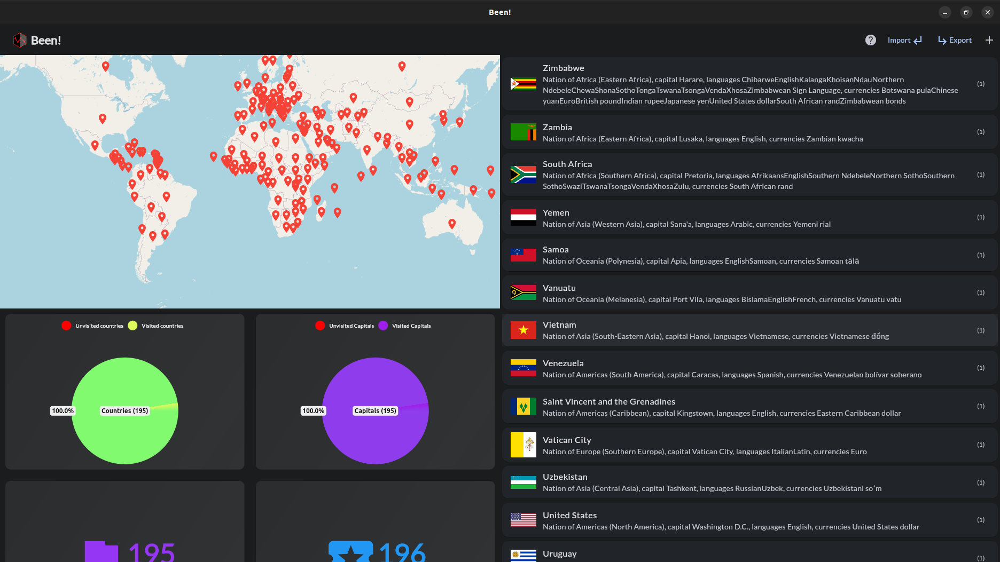
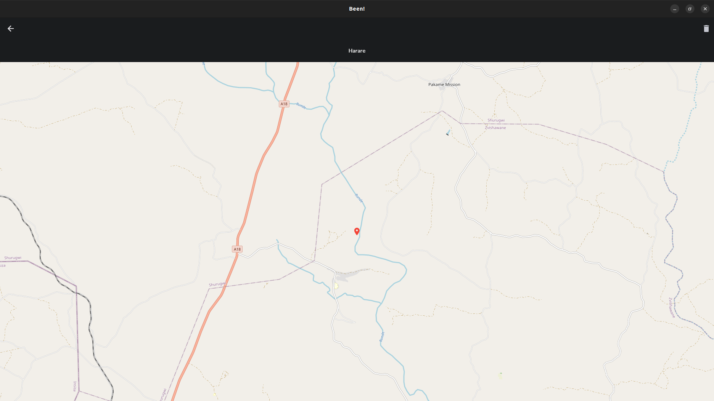
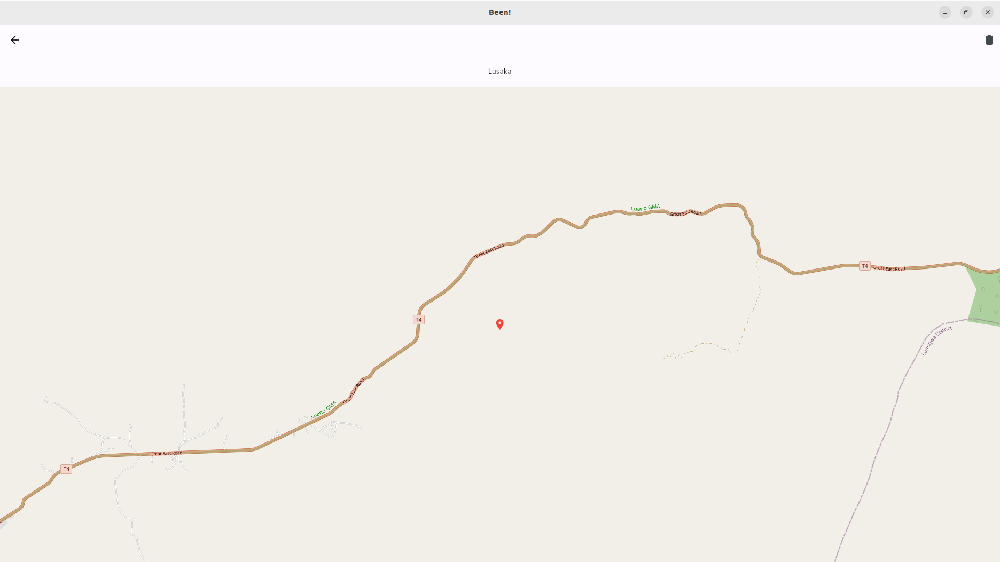

# Been!

Keep track of countries in the World that you have visited. The app visualizes the visited countries both as a list and as a world map.

# Download from Snap Store (Ubuntu)

# Screenshots

|                 Screenshots                 |                                             |
| :-----------------------------------------: | :-----------------------------------------: |
|  |  |
|  |  |

If you found a bug, please [contact me](http://andre-i.eu/#contactme).

# Technologies

Dart + Flutter
